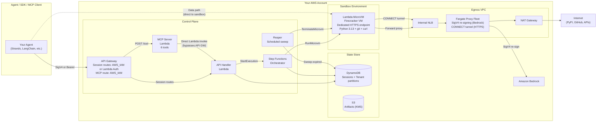
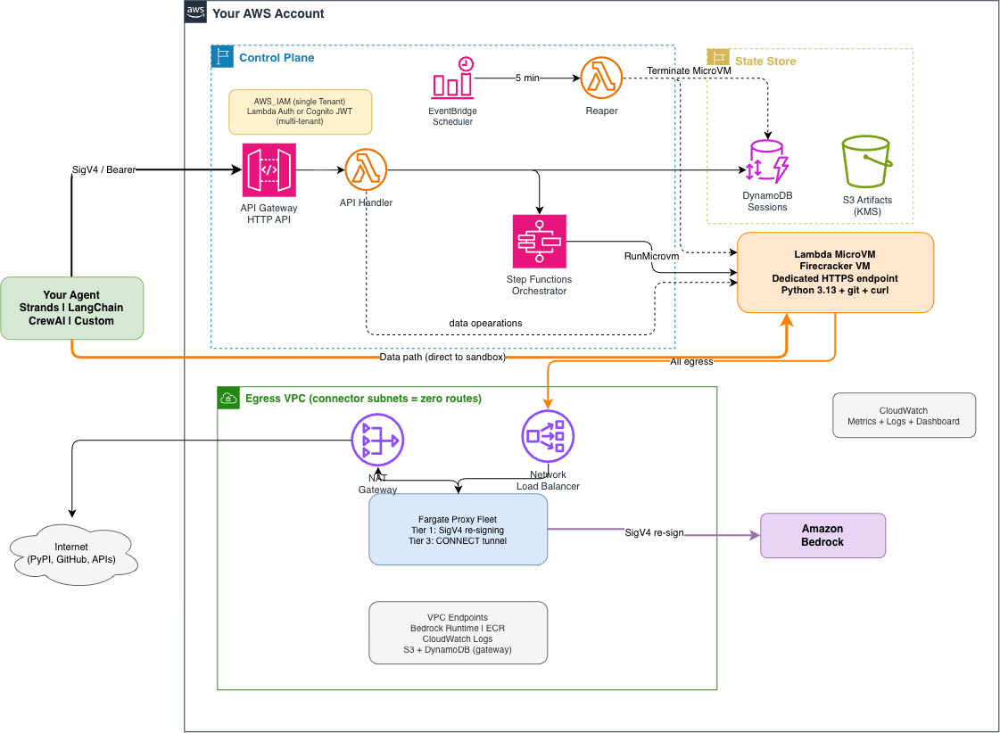

> **⚠️ Important:** This is sample code for non-production usage. You should work with your security and legal teams to meet your organizational security, regulatory and compliance requirements before deployment.

# AWS Serverless Agent Sandbox

Governed, isolated compute sandboxes for AI agent workloads — deployed in your own AWS account.

[How it Works](#how-it-works) · [Architecture](#architecture) · [Quick Start](#quick-start) · [Python SDK](#python-sdk) · [MCP Tools](#mcp-agent-tools) · [Agent Guide](#agent-sandbox-guide) · [Multi-tenancy](#multi-tenancy) · [Docs](#documentation) · [Cost](#cost)

---

## What is this?

A reference architecture that gives AI agents their own isolated Linux environments
(Firecracker MicroVMs) to execute code, manage files, and call models safely — all deployed
in your AWS account with policy-controlled egress and multi-tenant isolation.

**Key capabilities:**
- 🔒 **VM-level isolation** — each sandbox is a Firecracker MicroVM, not a container
- ⏸️ **Suspend/resume** — pause a sandbox and resume it later with full memory and disk state
- 🌐 **Governed egress** — all outbound traffic goes through a forward proxy with credential injection
- 🤖 **Bedrock proxy** — sandboxes call Amazon Bedrock through a SigV4-resigning proxy
- 🔍 **Web Search** — agents search the web via Bedrock Web Search with zero egress (no search engine URLs needed)
- 👥 **Multi-tenant** — isolated data partitions per tenant with Lambda authorizer or Cognito
- 🔧 **MCP tools** — six tools for agent frameworks (Strands, LangChain, CrewAI) via JSON-RPC
- 💾 **Persistent workspace** — opt-in S3 Files mount at `/mnt/workspace` that syncs to S3, survives suspend/resume/termination, with per-user isolation via access points
- 📦 **Python & TypeScript SDKs** — full-featured clients with git, PTY, streaming, and background process support

## What can I do with this?

- **Code interpreter** — let an AI agent write and execute code in an isolated environment
- **Data analysis** — upload CSVs, run pandas/matplotlib scripts, download results
- **Agent workflows** — multi-turn conversations where the agent maintains state across turns
- **CI/CD sandboxes** — run tests, build artifacts, clone repos in disposable environments
- **Model-generated code execution** — safely run LLM-generated code without risking your infrastructure

## Self-Hosted vs. Managed SaaS

This architecture is **self-hosted** — you deploy it in your own AWS account. Here's how that
compares to managed sandbox-as-a-service platforms:

| Capability | Self-hosted (this architecture) | Managed SaaS (typical) | Why |
|---|---|---|---|
| **Isolation** | Firecracker MicroVM (hardware-level) | Varies (VM or container) | Firecracker provides the strongest isolation boundary available on Lambda |
| **Data residency** | Your VPC, your region, your account | Provider-managed regions | You control where data lives — required for regulated workloads |
| **Egress control** | Policy-based proxy with destination allowlist | Typically none | Untrusted agent code can only reach destinations you explicitly permit |
| **Credential mediation** | SigV4 re-signing proxy (no API keys shared with sandbox) | API keys passed to sandbox | The sandbox never holds credentials for Bedrock or other services |
| **Suspend/resume** | Full memory + disk snapshot (GA) | Varies (beta or unavailable) | Lambda MicroVM-native capability, not a workaround |
| **Max session duration** | 8 hours | Up to 24 hours on some platforms | Lambda MicroVM service limit — extends as the service evolves |
| **Multi-tenancy** | Infrastructure-level (DDB partitions, NFS access points) | Application-level | Tenant isolation enforced by IAM and network boundaries, not just code |
| **MCP tools** | 6 built-in tools (Lambda-deployed) | Community-maintained or none | First-class MCP integration, deployed alongside the control plane |
| **Pricing** | AWS consumption only (~$4/day idle) | Per-sandbox-hour or per-second | No per-seat licensing — you pay for the AWS resources you use |
| **Customization** | Full source access, custom MicroVM images | Limited to provider's runtime | Build any runtime (Node.js, Java, R, data science stacks) |

**Choose self-hosted when** data must stay in your account, you need governed egress,
you want Bedrock integration without sharing credentials, or you need to customize
the runtime environment beyond what a managed service allows.

## How it Works

The architecture separates the **control plane** (session management) from the **data path**
(command execution and file operations):

**Step 1 — Create a session (control plane)**
```
Agent → POST /sessions (SigV4-signed) → API Gateway → Control Plane
       ← { sessionId, connection: { baseUrl, authHeaderValue } }
```

The Control Plane provisions a Firecracker MicroVM, starts the Step Functions orchestrator,
and returns a dedicated HTTPS endpoint URL and a JWE authentication token.

**Step 2 — Talk to the sandbox directly (data path)**
```
Agent → POST https://<microvm-id>.lambda-microvm.<region>.on.aws/protocol
        Header: X-aws-proxy-auth: <JWE token>
        Body: CBOR-encoded command (exec.request, fs.write, fs.read, ...)
       ← CBOR-encoded result (exit code, stdout, stderr, file content, ...)
```

After session creation, **all data-path traffic goes directly to the MicroVM** — the Control
Plane is not in the path. This means command execution, file I/O, and streaming have the
minimal latency since the Control Plane is not in the data path. The only reasons to call the Control Plane again are lifecycle
operations (suspend, resume, terminate, refresh token).

### What runs inside each MicroVM

Each MicroVM runs the **Sandbox Runtime** — a Python ASGI web server that serves:

| Endpoint | Transport | Purpose |
|----------|-----------|---------|
| `POST /protocol` | CBOR over HTTPS | Request/response — execute command, read/write files |
| `WS /protocol` | CBOR over WebSocket | Streaming output, interactive PTY, multi-message exchanges |
| `POST /run` | HTTP | Lifecycle hook — called after MicroVM starts, signals readiness |
| `POST /suspend` | HTTP | Lifecycle hook — quiesce connections, flush state |
| `POST /resume` | HTTP | Lifecycle hook — refresh egress identity |
| `POST /terminate` | HTTP | Lifecycle hook — persist artifacts, clean up |

The MicroVM is **not a container** — it's a Firecracker virtual machine with its own Linux
kernel, `/proc`, network namespace, and dedicated HTTPS endpoint. The image is built like
a Docker image (via a Dockerfile) but runs with VM-level isolation, not namespace isolation.

Pre-installed: Python 3.13, git, curl, jq, boto3, and the Sandbox Runtime.

## Architecture



**AWS architecture:**



See [docs/architecture.md](docs/architecture.md) for the full component details.

**Stacks deployed:**

| Stack | Purpose |
|-------|---------|
| NetworkStack | Egress VPC, connector subnets (zero routes), proxy subnets, NAT, VPC endpoints |
| StateStack | DynamoDB sessions table (2 GSIs, TTL), S3 artifact bucket (KMS encrypted) |
| ImageStack | MicroVM image version reference (context parameter) |
| EgressStack | Internal NLB, Fargate proxy fleet (Interceptor-based), Private CA, Secrets Manager, DDB egress policy |
| ControlPlaneStack | API Gateway (8 routes), Lambda handlers, Step Functions orchestrator, Reaper, CloudWatch access logs |
| AgentToolStack | MCP server Lambda for agent tool integration |

## Prerequisites

- **AWS account** with Lambda MicroVMs available (us-east-1, us-east-2, us-west-2, ap-northeast-1, eu-west-1)
- **AWS CLI v2** or **AWS CLI v1 ≥ 1.38.0** (botocore ≥ 1.35.76) — older versions do not include the `lambda-microvms` service model. Verify with `aws lambda-microvms help`; if it returns "Invalid choice", upgrade your CLI
- **AWS credentials** configured (`aws sts get-caller-identity` succeeds)
- **Node.js 22+** (`node --version`)
- **Python 3.13** (`python3 --version`)
- **uv** package manager (`uv --version`) — install from https://docs.astral.sh/uv/
- **AWS CDK CLI** (`npm install -g aws-cdk`)
- **CDK bootstrap** in the target account/region:
  ```bash
  npx cdk bootstrap aws://ACCOUNT_ID/REGION
  ```

## Quick Start

### 1. Install dependencies

```bash
uv sync --extra iac
npm ci --prefix sdk/typescript  # optional, for TypeScript SDK
```

### 2. Build the MicroVM image

The MicroVM image contains the Sandbox Runtime (Python ASGI server, command execution,
file I/O, streaming). This step uses the Lambda MicroVM image build API.

```bash
uv run python scripts/build-image.py --region us-east-1
```

This takes 3-5 minutes. On success it prints the image ARN:
```
Image ARN: arn:aws:lambda:us-east-1:ACCOUNT_ID:microvm-image:sandbox-runtime
```

Save this ARN — you'll need it for the deploy step.

### 3. Build the proxy image

The egress proxy image is built via AWS CodeBuild (no Docker Desktop required).

```bash
uv run python scripts/build-proxy.py --region us-east-1
```

This takes 3-5 minutes. On success it prints the image URI:
```
Image URI: ACCOUNT_ID.dkr.ecr.us-east-1.amazonaws.com/sandbox-egress-proxy:latest
```

### 4. Deploy all stacks

```bash
npx cdk deploy --all \
  -c imageVersion=IMAGE_ARN \
  -c proxyImageUri=IMAGE_URI \
  --require-approval never
```

> **Multi-tenant deployment**: To enable bearer token authentication with per-tenant isolation,
> add `-c deploymentProfile=multi-tenant` to the deploy command. The default deploys in
> single-tenant mode with `AWS_IAM` authentication.

Replace `IMAGE_ARN` and `IMAGE_URI` with the values from steps 2 and 3.

Deployment takes 5-10 minutes. The API Gateway URL is printed in the outputs:
```
ControlPlaneStack.ApiUrl = https://XXXXXXXXXX.execute-api.us-east-1.amazonaws.com
```

### 5. Enable persistent storage (optional)

> See [docs/persistence-setup.md](docs/persistence-setup.md) for the complete guide
> including prerequisites, troubleshooting, and teardown instructions.

Persistent workspaces let sessions mount S3-backed storage at `/mnt/workspace` that
survives suspend, resume, and termination. Run the setup script:

```bash
uv run python scripts/setup-s3files.py --region us-east-1
```

This creates the S3 Files infrastructure (file system, mount targets, access point) and
prints the CDK context flags. Re-deploy with those flags:

```bash
npx cdk deploy --all \
  -c imageVersion=IMAGE_ARN \
  -c proxyImageUri=IMAGE_URI \
  -c s3filesFilesystemId=fs-xxxx \
  -c s3filesAccessPointId=fsap-xxxx \
  -c s3filesMountTargetIps=10.0.x.x,10.0.y.y \
  --require-approval never
```

Without this step, sessions use ephemeral `/tmp` only (still fully functional).

### 6. Verify your deployment

```bash
uv run python -m demo \
  --api-url https://XXXXXXXXXX.execute-api.us-east-1.amazonaws.com \
  --region us-east-1 \
  --egress-endpoint XXXXXXXXXX.elb.us-east-1.amazonaws.com
```

If you enabled persistent storage (step 5), add `--persistence` to also verify the
S3 Files mount:

```bash
uv run python -m demo \
  --api-url https://XXXXXXXXXX.execute-api.us-east-1.amazonaws.com \
  --region us-east-1 \
  --egress-endpoint XXXXXXXXXX.elb.us-east-1.amazonaws.com \
  --persistence
```

Run the post-deploy verification to confirm everything works:

| Step | What it tests |
|------|---------------|
| create-session | Creates a session and provisions a MicroVM |
| basic-command | Executes a shell command inside the sandbox |
| bedrock-invocation | Invokes Amazon Bedrock through the governed egress proxy |
| model-generated-code | Runs Python code inside the sandbox |
| streaming-output | Streams output line by line |
| suspend-resume | Writes a file, suspends, resumes, reads back — content survives |
| egress-allowed | Tests an allowed egress destination |
| egress-blocked-connection | Tests a blocked TCP connection |
| egress-blocked-domain-resolution | Tests DNS resolution with a blocked domain |
| egress-blocked-ip-connection | Tests a blocked IP connection |
| persistence-verify-mount | Confirms /mnt/workspace NFS mount is present and writable (`--persistence` only) |
| persistence-survive-suspend | Writes to /mnt/workspace, suspends, resumes, reads back (`--persistence` only) |
| report-and-terminate | Reports metrics and terminates the session |

## Multi-tenancy

The platform supports two deployment profiles, controlled by the `-c deploymentProfile` CDK context:

| Profile | Default? | Auth | Authorizer | Deploy command |
|---------|----------|------|------------|----------------|
| `single-tenant` | ✅ Yes | `AWS_IAM` (SigV4) | None | `npx cdk deploy --all -c imageVersion=... -c proxyImageUri=...` |
| `multi-tenant` | No | `CUSTOM` (Lambda) | Bearer token → tenantId | Add `-c deploymentProfile=multi-tenant` |

In **single-tenant** mode, all routes use `AWS_IAM` authentication. Every session belongs to the default `operator` tenant.

In **multi-tenant** mode, a Lambda authorizer validates bearer tokens against `TENANT_TOKEN_MAP` and maps each token to a tenant. SigV4-authenticated callers (without a bearer token) are rejected — use bearer tokens for all API calls.

> **Production auth**: For production multi-tenant deployments, replace the Lambda authorizer
> with a **Cognito JWT authorizer** — API Gateway validates JWTs natively (zero Lambda
> overhead) and tenant ID comes from a JWT claim. See the
> [Cognito Integration Guide](docs/cognito-auth.md) for step-by-step migration instructions.

### How tenant resolution works

**Single-tenant (default):**

| Authentication | Tenant | Use case |
|---------------|--------|----------|
| IAM (SigV4) | Default: `operator` | All callers share one tenant |
| No auth | Rejected (403) | API Gateway rejects unsigned requests |

**Multi-tenant (`-c deploymentProfile=multi-tenant`):**

| Authentication | Tenant | Use case |
|---------------|--------|----------|
| Bearer token (`Authorization: Bearer <token>`) | Mapped from `TENANT_TOKEN_MAP` | Each tenant gets a unique token |
| No valid bearer token | Rejected (403) | Lambda authorizer rejects |

Each tenant gets an isolated DynamoDB partition. Sessions, artifacts, and list results
are confined to the calling tenant's partition — a tenant cannot see or address another
tenant's data.

### Workspace isolation (S3 Files)

When `persistence: true` is used, each session gets its own S3 Files access point with
a root directory scoped to `/<tenantId>/<principalId>/<sessionId>/` (or
`/<tenantId>/<principalId>/<affinityKey>/` with an affinity key). This provides:

- **Tenant isolation**: Different tenants get different `/<tenantId>/` prefixes — NFS-level,
  not application-level. A mount physically cannot see outside its access point root.
- **User isolation within a tenant**: The `<principalId>` (authenticated caller identity)
  is included in the path. Two users in the same tenant with the same affinity key get
  different workspaces.
- **Session isolation**: Without an affinity key, each session gets its own workspace
  directory that no other session can access.

The access point is created server-side by the orchestrator — the client only provides
`persistence` and optionally `affinityKey`. The path components (`tenantId`, `principalId`)
come from the authenticated request context, not from client input.

### Deploy

```bash
# Single-tenant (default): AWS_IAM auth, no authorizer
npx cdk deploy --all \
  -c imageVersion=IMAGE_ARN \
  -c proxyImageUri=IMAGE_URI

# Multi-tenant: Lambda authorizer with bearer tokens
npx cdk deploy --all \
  -c imageVersion=IMAGE_ARN \
  -c proxyImageUri=IMAGE_URI \
  -c deploymentProfile=multi-tenant
```

### Demo tokens (multi-tenant only)

When deployed with `-c deploymentProfile=multi-tenant`, the authorizer includes two demo tokens:

| Token | Tenant ID |
|-------|-----------|
| `demo-token-tenant-a` | `tenant-a` |
| `demo-token-tenant-b` | `tenant-b` |

```bash
# Multi-tenant: bearer token (requires -c deploymentProfile=multi-tenant)
curl -H "Authorization: Bearer demo-token-tenant-a" \
  https://xxx.execute-api.us-east-1.amazonaws.com/sessions

# Single-tenant (default): IAM auth
curl --aws-sigv4 "aws:amz:us-east-1:execute-api" \
  --user "$ACCESS_KEY:$SECRET_KEY" \
  https://xxx.execute-api.us-east-1.amazonaws.com/sessions
```

To customize the token mapping, set `TENANT_TOKEN_MAP` on the authorizer Lambda:
`{"my-token": "my-tenant", "another-token": "another-tenant"}`.

### Session limits

| Limit | Default | Environment variable |
|-------|---------|---------------------|
| Per tenant | 100 concurrent sessions | `SESSION_LIMIT_PER_TENANT` |
| Per user | 5 concurrent sessions | `SESSION_LIMIT_PER_USER` |

Returns HTTP 429 when exceeded.

### For single-tenant operators

Single-tenant is the **default deployment**. No extra configuration needed — just deploy
without the `deploymentProfile` context flag. All routes use `AWS_IAM` authentication,
no Lambda authorizer is deployed, and every session belongs to the `operator` tenant.

### Swapping for Cognito

To use Amazon Cognito instead of the demo token authorizer:

1. Create a Cognito User Pool with a custom attribute `custom:tenantId`.
2. In the CDK stack, replace the `CfnAuthorizer` with a JWT authorizer pointing at

## Python SDK

```python
from agent_sandbox import SandboxClient

client = SandboxClient(
    api_url="https://xxx.execute-api.us-east-1.amazonaws.com",
    region="us-east-1",
)

# Create a sandbox and run code
with client.create_session() as session:
    session.wait_ready()

    # Execute commands
    result = session.execute("echo 'Hello from sandbox'")
    print(result.stdout)

    # File operations
    session.write_file("/tmp/script.py", "print('Hello from Python')")
    result = session.execute("python3 /tmp/script.py")
    print(result.stdout)

    # Git operations
    session.git.clone("https://github.com/user/repo", "/tmp/repo", depth=1)
    status = session.git.status(cwd="/tmp/repo")

    # Suspend and resume (memory + disk preserved)
    session.suspend()
    session.resume()
    session.wait_ready()

    # Background processes
    handle = session.execute_background("python3 server.py")
    print(f"PID: {handle.pid}, Running: {handle.is_running()}")

    # Streaming output
    session.execute_stream(
        "for i in $(seq 1 5); do echo $i; sleep 1; done",
        on_stdout=lambda chunk: print(chunk.decode(), end=""),
    )
# Session terminated automatically
```

### Extended operations

```python
# Filesystem helpers
if session.file_exists("/tmp/data.txt"):
    info = session.file_info("/tmp/data.txt")  # FileInfo(size, modified, permissions, file_type, path)
    print(f"Size: {info.size}, Permissions: {info.permissions}")

session.make_dir("/tmp/project/src")
session.rename_file("/tmp/old.txt", "/tmp/new.txt")

# Batch file write
session.write_files([
    ("/tmp/main.py", "print('hello')"),
    ("/tmp/config.json", '{"debug": true}'),
    ("/tmp/data.csv", "name,age\nAlice,30\nBob,25"),
])

# Recursive directory listing
entries = session.list_files_recursive("/tmp/project", depth=3)
for entry in entries:
    print(f"  {entry.kind}: {entry.name} ({entry.size} bytes)")

# Sandbox metrics
metrics = session.get_metrics()
print(f"Memory: {metrics.memory_available_kb}KB / {metrics.memory_total_kb}KB")
print(f"Load: {metrics.load_avg_1}")

# File watching (polling-based)
events = session.watch_files("/tmp/project", timeout=30, poll_interval=1.0)
for event in events:
    print(f"{event.event_type}: {event.path}")

# PTY session (simplified interactive terminal)
with session.open_pty() as pty:
    output = pty.send("ls -la /tmp")
    result = pty.send_and_receive("python3 --version")
    print(result.stdout)
```

### Multi-tenant authentication

```python
# Bearer token auth (named tenant)
client = SandboxClient(
    api_url="https://xxx.execute-api.us-east-1.amazonaws.com",
    region="us-east-1",
    token="demo-token-tenant-a",
)

# Get-or-create a session by affinity key (great for multi-turn agents)
session = client.resolve_session(affinity_key="conversation-123")
session.wait_ready()
```

> **Production auth**: The default Lambda authorizer uses bearer tokens for
> development. For production, swap to a **Cognito JWT authorizer** — the API Gateway
> validates JWTs natively (zero Lambda overhead) and tenant ID comes from a JWT claim.
> See [Cognito Integration Guide](docs/cognito-auth.md)
> for the migration steps.

### Command timeouts

The `timeout_seconds` parameter on `execute()` controls both how long the MicroVM
allows the command to run AND the HTTP round-trip timeout to the sandbox endpoint.
The default is 60 seconds.

For long-running operations (Bedrock calls with web search, large model inference,
data processing), increase it:

```python
# Default: 60s — fine for quick commands
result = sandbox.execute(["echo", "hello"])

# Long Bedrock call: 5 minutes
result = sandbox.execute(["python3", "call_bedrock.py"], timeout_seconds=300)

# Heavy data processing: 30 minutes
result = sandbox.execute(["python3", "process.py"], timeout_seconds=1800)
```

The HTTP timeout is set to `timeout_seconds + 10` to account for network overhead.
The maximum is bounded by the session's `maxDurationSeconds` (default 3600s / 1 hour).

## MCP Agent Tools

The sandbox exposes six MCP tools for agent frameworks. An agent can execute commands,
read/write files, and manage sessions without ever seeing a credential or session ID.

```bash
# The MCP server is deployed at POST /tool on the same API Gateway
curl -X POST https://xxx.execute-api.us-east-1.amazonaws.com/tool \
  --aws-sigv4 "aws:amz:us-east-1:execute-api" \
  -H "Content-Type: application/json" \
  -H "x-session-key: my-conversation-001" \
  -d '{"jsonrpc":"2.0","id":1,"method":"tools/list"}'
```

**Available tools:** `execute_command`, `read_file`, `write_file`, `list_files`, `delete_file`, `get_session_info`

The tools use the MCP JSON-RPC 2.0 protocol. Session management is automatic — the MCP
server provisions a sandbox on first tool call and reuses it for subsequent calls in the
same session. No credentials are returned to the calling model.

> **Important**: Include the `x-session-key` header on every tool call. The session key
> ties consecutive calls to the same sandbox. Without it, each call provisions a new
> MicroVM — files written by one call won't be visible to the next, and you'll incur
> unnecessary MicroVM costs. Use a stable identifier like a conversation ID or user
> session ID.

## Agent Sandbox Guide

If you're building an AI agent that runs inside the sandbox, read the
[Agent Sandbox Guide](docs/agent-sandbox-guide.md). It covers the practical details
agents need to know:

- **Bedrock access** — direct `boto3` calls are denied by IAM; use the HTTP forward proxy
  pattern (copy-pasteable helper included)
- **Package installation** — `pip install --target /tmp/pylibs` (system dirs are read-only)
- **Egress** — what destinations are allowed (PyPI, npm) vs blocked (everything else)
- **Persistence** — `/tmp` is ephemeral, `/mnt/workspace` survives suspend/resume/termination
- **Git** — works, but NFS-mounted paths need `git config --global --add safe.directory '*'`
- **Common pitfalls** — 8 issues agents hit and how to avoid them

## Console (Visual Control Plane)

A Next.js dashboard for managing sandbox sessions, running commands, and exploring
the API. Runs locally against your deployed API.

### Quick start

```bash
cd console
npm install
npm run dev
```

Open `http://localhost:3000/settings` and configure:
- **API URL**: your deployed API Gateway URL
- **Region**: the region you deployed to
- **Bearer token**: for multi-tenant access (e.g. `demo-token-tenant-a`)

### Pages

| Page | What it does |
|------|-------------|
| Dashboard | Session counts, status overview, recent sessions |
| Sessions | Full session list with filters, create/terminate |
| Session Detail | Lifecycle pipeline, terminal, file browser, live metrics charts, log viewer |
| Playground | AI-powered chat that executes commands in a sandbox (Bedrock-backed) |
| API Explorer | Raw API calls with preset operations and request/response log |
| Settings | API connection configuration |

### Features

- **Cmd+K** command palette for quick navigation
- **Create session dialog** with persistence toggle, duration, affinity key
- **Live metrics**: memory, CPU, disk charts updated every 5s
- **File browser**: navigate any path, not just /tmp
- **Dark/light theme** toggle
- **Toast notifications** for all actions

No hardcoded URLs or credentials. Everything is configured via Settings.


## API

All routes require authentication. In single-tenant mode (default), routes use `AWS_IAM`
(SigV4). In multi-tenant mode, routes use a Lambda authorizer that validates bearer tokens.
No unauthenticated route exists in either mode.

| Method | Path | Operation |
|--------|------|-----------|
| POST | /sessions | CreateSession |
| POST | /sessions/resolve | ResolveSession (get-or-create by affinity key) |
| GET | /sessions/{id} | GetSession |
| GET | /sessions | ListSessions |
| POST | /sessions/{id}/suspend | SuspendSession |
| POST | /sessions/{id}/resume | ResumeSession |
| POST | /sessions/{id}/terminate | TerminateSession |
| POST | /sessions/{id}/connection | RefreshConnection |


## Persistent Workspace (S3 Files)

Sessions can mount a persistent workspace at `/mnt/workspace` backed by Amazon S3 Files.
Files written there sync bidirectionally to S3 and survive suspend, resume, and termination.

### Enable per session

```python
# Python SDK
session = client.create_session(persistence=True)
# Files in /mnt/workspace sync to S3

# With affinity key — same workspace across sessions
session_a = client.create_session(persistence=True, affinity_key="my-project")
# ... terminate session_a ...
session_b = client.create_session(persistence=True, affinity_key="my-project")
# session_b sees session_a's files at /mnt/workspace
```

```typescript
// TypeScript SDK
const session = await client.createSession({ persistence: true });
const shared = await client.createSession({ persistence: true, affinityKey: "my-project" });
```

### How it works

- Each persistent session gets its own S3 Files access point scoped to `/<tenantId>/<sessionId>/`
- With `affinityKey`, sessions share an access point scoped to `/<tenantId>/<affinityKey>/`
- The mount happens automatically in the `/run` lifecycle hook (and re-mounts on `/resume`)
- Without `persistence`, sessions use ephemeral `/tmp` only (default behavior, backward compatible)
- Isolation is enforced at the NFS level — access points cannot see each other's root directories

### Setup

For the complete setup guide including prerequisites, troubleshooting, and teardown,
see [docs/persistence-setup.md](docs/persistence-setup.md).

Quick version: see [Quick Start step 5](#5-enable-persistent-storage-optional) for the one-command
setup (`scripts/setup-s3files.py`).


## E2B Migration

Migrating from E2B? The SDK provides direct equivalents for most E2B operations:

| E2B | AWS Serverless Agent Sandbox |
|-----|-----|
| `Sandbox()` | `client.create_session()` |
| `sandbox.commands.run(cmd)` | `session.execute(cmd)` |
| `sandbox.commands.run(cmd, background=True)` | `session.execute_background(cmd)` |
| `sandbox.commands.run(cmd, on_stdout=cb)` | `session.execute_stream(cmd, on_stdout=cb)` |
| `sandbox.files.read/write/list/remove` | `session.read_file/write_file/list_files/delete_file` |
| `sandbox.files.exists/rename/make_dir` | `session.file_exists/rename_file/make_dir` |
| `sandbox.files.write_files(...)` | `session.write_files([...])` |
| `sandbox.beta_pause()` | `session.suspend()` (GA, not beta) |
| `sandbox.git.clone/status/commit` | `session.git.clone/status/commit` |
| `sandbox.get_metrics()` | `session.get_metrics()` |
| `sandbox.pty.create(...)` | `session.open_pty(...)` |
| `Sandbox.connect(id)` | `client.get_session(id)` or `client.resolve_session(affinity_key)` |

**Coverage**: 34 of 54 E2B operations have direct SDK equivalents, 12 more work via
`session.execute()`. Three E2B features have no equivalent due to service limitations:
fork-from-running-state, dynamic timeout extension, and 24-hour session duration.

See [docs/e2b-migration-map.md](docs/e2b-migration-map.md) for the complete
operation-by-operation mapping with code examples and a step-by-step migration guide.

## Custom Templates

See [docs/custom-templates.md](docs/custom-templates.md) for instructions on building
custom MicroVM images with pre-installed packages (Node.js, Java, R, data science tools).

## Cost

**Idle cost** (no active sessions): approximately $4/day ($0.17/hr)
- Fargate proxy fleet (2 tasks): ≈$0.049/hr
- NAT Gateway: ≈$0.045/hr
- Internal NLB: ≈$0.023/hr
- VPC Endpoints (5 interface): ≈$0.050/hr

**Per-session cost**: ~$0.0002 per session (Lambda MicroVM compute + DynamoDB + Step Functions)

## Teardown

Remove all deployed resources:

```bash
npx cdk destroy --all
```

This deletes all stacks in reverse dependency order. The S3 bucket and DynamoDB table
have removal policies set to DESTROY and will be deleted.

**Note**: The MicroVM image and ECR repository created by the build scripts are not managed
by CDK. To remove them:

```bash
# Delete the MicroVM image
aws lambda delete-microvm-image \
  --image-identifier arn:aws:lambda:us-east-1:ACCOUNT_ID:microvm-image:sandbox-runtime \
  --region us-east-1 2>/dev/null || echo "Image may need manual deletion"

# Delete the ECR repository
aws ecr delete-repository \
  --repository-name sandbox-egress-proxy \
  --force \
  --region us-east-1
```

## Running Tests

```bash
uv sync --all-extras   # first time only — installs test dependencies
uv run pytest tests/ -q
```

The offline test suite (1700+ tests) covers the provider contract, orchestration protocol,
credential issuance, admission policy, and architectural lint rules. No AWS credentials needed.

## Documentation

Detailed guides live in the [docs/](docs/) directory:

| Guide | Description |
|-------|-------------|
| [Egress Allowlist](docs/egress-allowlist-guide.md) | Configure allowed destinations, update the policy, proxy connection methods |
| [Security Posture](docs/security-posture.md) | Isolation model, threat model, hardening recommendations |
| [Compliance Posture](docs/compliance-posture.md) | Service compliance programs (HIPAA, SOC, PCI, FedRAMP) |
| [Architecture](docs/architecture.md) | Component diagram, lifecycle flow, networking |
| [E2B Migration](docs/e2b-migration-map.md) | Operation-by-operation SDK mapping from E2B |
| [Custom Templates](docs/custom-templates.md) | Customize the MicroVM image |
| [Python SDK](docs/python-sdk.md) | Full API reference for the Python client |
| [TypeScript SDK](docs/typescript-sdk.md) | Full API reference for the TypeScript client |

## Repository Layout

| Directory | Contents |
|-----------|----------|
| `iac/` | AWS CDK application and stacks (Python) |
| `runtime/` | Sandbox Runtime (Python ASGI server inside the MicroVM) |
| `control_plane/` | Control Plane handlers, Compute Provider seam, State Store |
| `egress/` | Egress proxy (Fargate) |
| `protocol/` | Sandbox Protocol schema and cross-language test vectors |
| `sdk/python/` | Python Client SDK |
| `sdk/typescript/` | TypeScript Client SDK |
| `agent_tools/` | Agent Tool Interface (MCP over streamable HTTP) |
| `demo/` | Demo application |
| `scripts/` | Build scripts (MicroVM image, proxy image) |
| `docs/` | Architecture, migration guide, custom templates |
| `tests/` | Offline test suite |

## Supported Regions

Lambda MicroVMs is available in:
- us-east-1 (N. Virginia)
- us-east-2 (Ohio)
- us-west-2 (Oregon)
- ap-northeast-1 (Tokyo)
- eu-west-1 (Ireland)

## Contributing

See [CONTRIBUTING.md](CONTRIBUTING.md) for development setup and guidelines.

## Important Notice

This is sample code for non-production usage. You should work with your security and legal teams to meet your organizational security, regulatory and compliance requirements before deployment.

## Licence

MIT No Attribution (MIT-0). See [LICENSE](./LICENSE).
