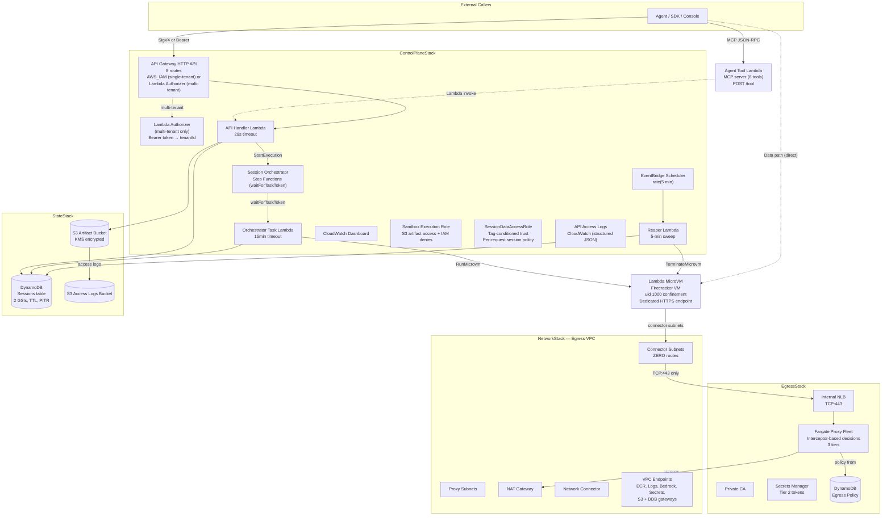

# Architecture: AWS Serverless Agent Sandbox

## Overview

Seven CDK stacks deployed in dependency order. The architecture separates the **control plane**
(session lifecycle) from the **data path** (command execution via direct MicroVM endpoint) and the
**egress path** (governed outbound traffic through a proxy fleet).

## Deployed Components



## Stacks

| Stack | Purpose | Key resources |
|-------|---------|---------------|
| **NetworkStack** | Egress VPC with 3 subnet tiers | VPC, connector/proxy/NAT subnets, NAT Gateway, 5 VPC endpoints, Network Connector |
| **StateStack** | Session state and artifacts | DynamoDB table (2 GSIs, TTL, PITR), S3 bucket (KMS), S3 access logs bucket |
| **ImageStack** | MicroVM image version reference | CDK context parameter (`imageVersion`) — no AWS resources |
| **EgressStack** | Governed outbound proxy | Internal NLB, Fargate service (2 tasks), Private CA, Secrets Manager, DDB egress policy table |
| **ControlPlaneStack** | API, orchestration, lifecycle | API Gateway, Lambda handlers, Step Functions, Reaper, CloudWatch dashboard, IAM roles |
| **AgentToolStack** | MCP tool interface | Lambda function (POST /tool) |
| **DemoStack** | Placeholder for demo resources | Currently empty |

---

## Component Details

### API Gateway (ControlPlaneStack)

HTTP API with 8 routes. Authorization mode is determined by the **deployment profile**:

| Profile | Auth type | Authorizer | How to deploy |
|---------|-----------|------------|---------------|
| `single-tenant` (default) | `AWS_IAM` | None — SigV4 at the API Gateway level | `npx cdk deploy --all` |
| `multi-tenant` | `CUSTOM` | Lambda Authorizer (bearer tokens) | `-c deploymentProfile=multi-tenant` |

Routes:

| Method | Path | Operation | Description |
|--------|------|-----------|-------------|
| POST | /sessions | CreateSession | Provision a new MicroVM sandbox |
| POST | /sessions/resolve | ResolveSession | Get-or-create by affinity key |
| GET | /sessions/{id} | GetSession | Current state + connection descriptor |
| GET | /sessions | ListSessions | All sessions in the caller's tenant partition |
| POST | /sessions/{id}/suspend | SuspendSession | Snapshot memory + disk |
| POST | /sessions/{id}/resume | ResumeSession | Restore from snapshot |
| POST | /sessions/{id}/terminate | TerminateSession | Destroy MicroVM + clean up |
| POST | /sessions/{id}/connection | RefreshConnection | Mint a fresh JWE token |

**Access logging**: Structured JSON to CloudWatch — requestId, sourceIp, httpMethod, routeKey, status, tenantId.

### Lambda Authorizer (ControlPlaneStack — multi-tenant only)

Validates bearer tokens against `TENANT_TOKEN_MAP` (environment variable, JSON object).
Returns `{ isAuthorized: true, context: { tenantId, principalId } }` or rejects.

- No hardcoded fallback tokens — absent/invalid `TENANT_TOKEN_MAP` denies all
- Token comparison uses `hmac.compare_digest` (constant-time)
- Not deployed in single-tenant mode

### API Handler Lambda (ControlPlaneStack)

Handles all 8 routes. Core responsibilities:

- **Tenant resolution**: In multi-tenant mode, reads `tenantId` from the authorizer context. In single-tenant mode, uses the fixed `operator` tenant.
- **Session CRUD**: Reads/writes DynamoDB session records. Every query is scoped to the caller's tenant via `LeadingKeys` IAM condition on the `SessionDataAccessRole`.
- **Orchestration**: Starts Step Functions executions for CreateSession. The execution manages the full MicroVM lifecycle.
- **Connection credentials**: Mints JWE tokens for data-path authentication. The private key exists only in the MicroVM's memory.

**Timeout**: 29 seconds (API Gateway HTTP API maximum is 30s).

### SessionDataAccessRole (ControlPlaneStack)

IAM role the handler assumes per-request with an inline **session policy** that confines:
- DynamoDB access to one tenant's partition key (`LeadingKeys` condition)
- S3 access to one tenant's artifact prefix

**Trust policy**: Account principal with `aws:PrincipalTag/SandboxComponent = control-plane-handler` condition. Only the API Handler and Orchestrator Task Lambda carry this tag.

### Session Orchestrator — Step Functions (ControlPlaneStack)

Standard Workflow using `waitForTaskToken` pattern (callback-based, not polling). Lifecycle:

```
CreateSession → Provision → ClaimSandbox → AwaitReady → PublishCredential
    → [RUNNING: waitForTaskToken — waits for suspend/resume/terminate callback]
    → Terminate → ReleaseCheck → Cleanup → Succeed
```

Key states:
1. **Provision**: Calls `RunMicrovm` via the Task Lambda
2. **ClaimSandbox**: Conditional DDB write (one MicroVM per session, prevents races)
3. **AwaitReady**: Polls the `/ready` lifecycle hook until the runtime reports readiness
4. **PublishCredential**: Mints JWE connection token, writes to DDB session row
5. **WaitForTaskToken**: The session is RUNNING. The state machine waits for a callback (suspend, resume, or terminate). No polling, no Lambda invocations while idle.
6. **Terminate**: Calls `TerminateMicrovm`, settles the session record

**Max duration**: 8 hours (Lambda MicroVM limit). The state machine enforces this with a `TimeoutSeconds` on the wait state.

### Orchestrator Task Lambda (ControlPlaneStack)

Invoked by Step Functions for every task state. The **only code path** that calls `RunMicrovm` and `TerminateMicrovm` (enforced by a CI lint rule). 15-minute timeout for long tasks like AwaitReady.

### Reaper Lambda + EventBridge Schedule (ControlPlaneStack)

Safety net for when Step Functions executions fail. Every 5 minutes:

1. Queries DynamoDB's `deadline-index` GSI for sessions past their `reapDeadline`
2. Classifies each: max-duration reached, suspended too long, or orphaned
3. Terminates the MicroVM directly (no Step Functions dependency)
4. Settles the session record in DynamoDB

The Reaper has **no dependency on Step Functions** — it reads only DynamoDB and calls the MicroVM API. This is how it catches orphaned sandboxes from crashed executions.

### Sandbox Execution Role (ControlPlaneStack)

IAM role every MicroVM runs with. Grants:
- `s3:GetObject` / `s3:PutObject` on the artifact bucket under `tenants/*/sessions/*/*`
  (narrowed to one tenant by the session policy at `sts:AssumeRole` time)
- `s3files:Client*` on the S3 Files filesystem (for persistent workspace)

Explicitly denies:
- `secretsmanager:GetSecretValue` on egress secrets (proxy-only)
- `kms:Decrypt` on the egress encryption key
- `sts:AssumeRole` on the proxy task role
- `bedrock:InvokeModel*`, `bedrock:InvokeAgent`, `sagemaker:InvokeEndpoint*` (must go through proxy)

### Lambda MicroVM (provisioned by ControlPlaneStack)

Firecracker virtual machine with:
- Dedicated HTTPS endpoint (`https://<id>.lambda-microvm.<region>.on.aws`)
- uid 1000 confinement (non-root, `NO_NEW_PRIVS`, 8 capabilities dropped)
- Read-only rootfs, writable `/tmp` (ephemeral) and `/mnt/workspace` (persistent, optional)
- 8-hour max duration, suspend/resume with full memory + disk snapshot
- Network connector attachment → lands in zero-route connector subnets

**Runtime**: Python ASGI server handling CBOR-encoded requests (exec, file I/O, streaming, PTY).

**Lifecycle hooks**: `/run` (startup), `/suspend` (quiesce), `/resume` (refresh), `/terminate` (cleanup).

### DynamoDB Sessions Table (StateStack)

| Attribute | Type | Description |
|-----------|------|-------------|
| `pk` | String | `T#<tenantId>` — tenant partition key |
| `sk` | String | `S#<sessionId>` — session sort key |
| `lifecycleState` | String | ORCHESTRATING, PROVISIONING, RUNNING, SUSPENDED, TERMINATED, FAILED |
| `connection` | Map | `{ baseUrl, authHeaderName, authHeaderValue }` — JWE-encrypted |
| `reapDeadline` | Number | Unix timestamp for Reaper sweep |
| `createdAt` / `updatedAt` | Number | Millisecond timestamps |
| `tenantId` / `principalId` | String | Caller identity |
| `affinityKey` | String | Optional workspace sharing key |

**GSIs**:
- `tenant-index`: pk=tenantId, sk=createdAt (for ListSessions)
- `deadline-index`: pk=reapShard, sk=reapDeadline (for Reaper sweep)

**Settings**: On-demand billing, TTL on `reapDeadline`, point-in-time recovery enabled.

### S3 Artifact Bucket (StateStack)

Stores MicroVM rootfs images and session artifacts. KMS-encrypted with a customer-managed key. Bucket policy denies non-TLS requests. Lifecycle rule expires artifacts after the configured retention period. Access logs go to a separate S3 bucket.

### Network Connector + Egress VPC (NetworkStack)

`AWS::Lambda::NetworkConnector` routes MicroVM traffic through the VPC instead of the default Lambda networking (public internet). **Without it, every MicroVM has unrestricted internet access.** This is the critical egress control mechanism.

**Subnet layout**:
- **Connector subnets**: Zero route table entries. MicroVMs land here. Security group allows only TCP:443 to the NLB. No other path exists.
- **Proxy subnets**: Fargate proxy fleet runs here. Route to NAT gateway.
- **NAT subnet**: Holds the NAT gateway for internet-bound traffic.

**VPC Endpoints**: ECR (for proxy image pull), CloudWatch Logs, Bedrock, Secrets Manager, S3 gateway, DynamoDB gateway.

### Egress Proxy Fleet — Fargate (EgressStack)

Forward proxy mediating **all** sandbox outbound traffic. Uses the `Interceptor` from `egress/interception.py` for all permit/deny decisions.

**Three tiers**:

| Tier | Mode | What it does | Credential handling |
|------|------|-------------|-------------------|
| **Tier 1** | HTTP forward proxy | SigV4 re-signing for Bedrock | Strips sandbox auth headers, re-signs with proxy's IAM role |
| **Tier 2** | HTTP forward proxy | Token injection for aliased destinations | Reads secret from Secrets Manager, injects as configured header |
| **Tier 3** | CONNECT tunnel | TCP pass-through for allowed hosts | Nothing — proxy sees only the hostname |

**Security properties enforced by the Interceptor**:
- Tier separation: Bedrock (Tier 1) only via forward proxy, not CONNECT
- Host/SNI mismatch detection
- Echo path denylist (configurable per destination)
- Body size cap (10 MB) and header limits (100 headers, 16 KB each)
- Fail-closed: DDB read failure → deny all traffic

**Policy source**: DynamoDB table (`EGRESS_POLICY` item). Cached for 30 seconds (configurable). Operators update via `aws dynamodb put-item` — no proxy restart needed.

### Agent Tool Lambda — MCP Server (AgentToolStack)

Lambda function serving the Model Context Protocol (JSON-RPC 2.0) at `POST /tool`. Protected by `AWS_IAM` auth.

**Tools**: `execute_command`, `read_file`, `write_file`, `list_files`, `delete_file`, `get_session_info`

The MCP server provisions a sandbox on first tool call and reuses it for subsequent calls. Session key is hashed with the caller's IAM principal ARN so different callers cannot share sessions.

---

## Data Path (Direct to MicroVM)

After session creation, **all data-path traffic goes directly to the MicroVM** — the control plane is not in the path:

```
Agent → POST https://<microvm-id>.lambda-microvm.<region>.on.aws/protocol
        Header: X-aws-proxy-auth: <JWE token>
        Body: CBOR-encoded request
       ← CBOR-encoded response
```

This gives minimal latency for command execution, file I/O, and streaming.

## Egress Flow

```
MicroVM (connector subnet, zero routes)
  → security group allows only TCP:443 to NLB
  → Internal NLB
  → Fargate proxy (Interceptor checks policy from DDB)
    → Tier 1 (Bedrock): strips sandbox auth, re-signs with proxy role, forwards via HTTPS
    → Tier 2 (aliases): injects token from Secrets Manager, forwards via HTTPS
    → Tier 3 (CONNECT): TCP tunnel to allowed host
    → Denied: 403 Forbidden
  → internet via NAT Gateway (permitted destinations only)
```

## Security Model

| Layer | Control | What it prevents |
|-------|---------|-----------------|
| **Network** | Zero-route subnets | Direct internet access from sandbox |
| **Network** | Proxy allowlist (Interceptor) | Unauthorized egress destinations |
| **Network** | Tier separation | Bedrock bypass (must go through SigV4 proxy) |
| **Network** | Internal NLB (no public IP) | Direct proxy access from internet |
| **Compute** | Firecracker MicroVM | Cross-sandbox memory/process access |
| **Compute** | uid 1000 + NO_NEW_PRIVS | Privilege escalation to root |
| **Compute** | 8 capability drops | Kernel-level attacks (BPF, mknod, ptrace, etc.) |
| **Compute** | Confinement fails closed | Unconfined execution if libc/setuid fails |
| **Identity** | AWS_IAM / Lambda authorizer | Unauthenticated API access |
| **Identity** | Per-tenant DDB partitions | Cross-tenant data access |
| **Identity** | Per-session NFS access points | Cross-session file access |
| **Identity** | Tag-conditioned trust policy | Unauthorized role assumption |
| **Identity** | IAM deny policies (4 explicit denies) | Lateral movement via IMDS creds |
| **Data** | KMS encryption (S3, DDB) | Data at rest exposure |
| **Data** | TLS everywhere | Data in transit exposure |
| **Data** | JWE connection tokens | Credential theft in transit |
| **Operations** | Reaper (5-min sweep) | Orphaned resource accumulation |
| **Operations** | API access logging | Request audit trail |
| **Operations** | VPC Flow Logs | Network forensics |

## Idle Cost

| Component | Hourly cost (approx) |
|-----------|---------------------|
| 2× Fargate tasks (0.5 vCPU, 1 GB) | ~$0.049/hr |
| NAT Gateway | ~$0.045/hr |
| Internal NLB | ~$0.023/hr |
| VPC Endpoints (5 interface) | ~$0.050/hr |
| DynamoDB (on-demand, idle) | ~$0 |
| **Total idle** | **~$0.17/hr (~$4/day)** |

## Deployment

```bash
# 1. Install dependencies
uv sync --extra iac

# 2. Build the MicroVM image (3-5 minutes)
uv run python scripts/build-image.py --region us-east-1
# Outputs the image ARN — use it in step 4

# 3. Build the proxy image (3-5 minutes)
uv run python scripts/build-proxy.py --region us-east-1
# Outputs the proxy image URI — use it in step 4

# 4. Deploy all stacks
npx cdk deploy --all \
  -c imageVersion=<IMAGE_ARN> \
  -c proxyImageUri=<PROXY_URI> \
  --require-approval never

# Optional: multi-tenant mode
npx cdk deploy --all \
  -c imageVersion=<IMAGE_ARN> \
  -c proxyImageUri=<PROXY_URI> \
  -c deploymentProfile=multi-tenant \
  --require-approval never

# Optional: persistent storage (S3 Files)
uv run python scripts/setup-s3files.py --region us-east-1
# Then redeploy with the S3 Files context flags
```

## Supported Regions

Lambda MicroVMs: us-east-1, us-east-2, us-west-2, ap-northeast-1, eu-west-1.
